
<a href="#">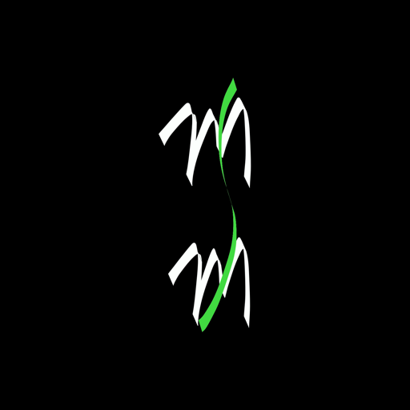</a>
 
<h2 align="center"><b>MSM</b></h2>
<h4 align="center">All in one manager for your media server</h4>
<!-- 

 -->

<a href="#screenshots">Screenshots</a> &bull; <a href="#description">Description</a> &bull; <a href="#features">Features</a> &bull; <a href="#contribution">Contribution</a>&bull; <a href="https://github.com/prinzpiuz/MSM_mobile/releases">Releases</a> &bull;<a href="#setup">How to setup a media server</a>

## Screenshots
[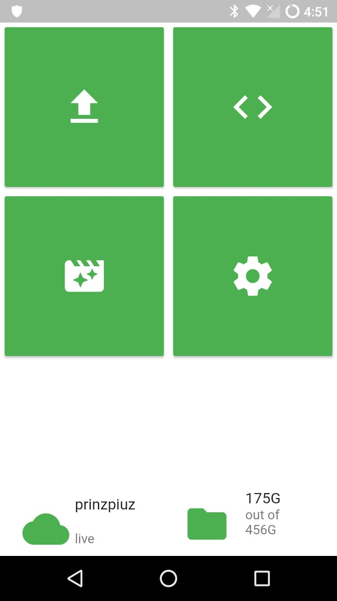](screenshots/main_page.jpg)
[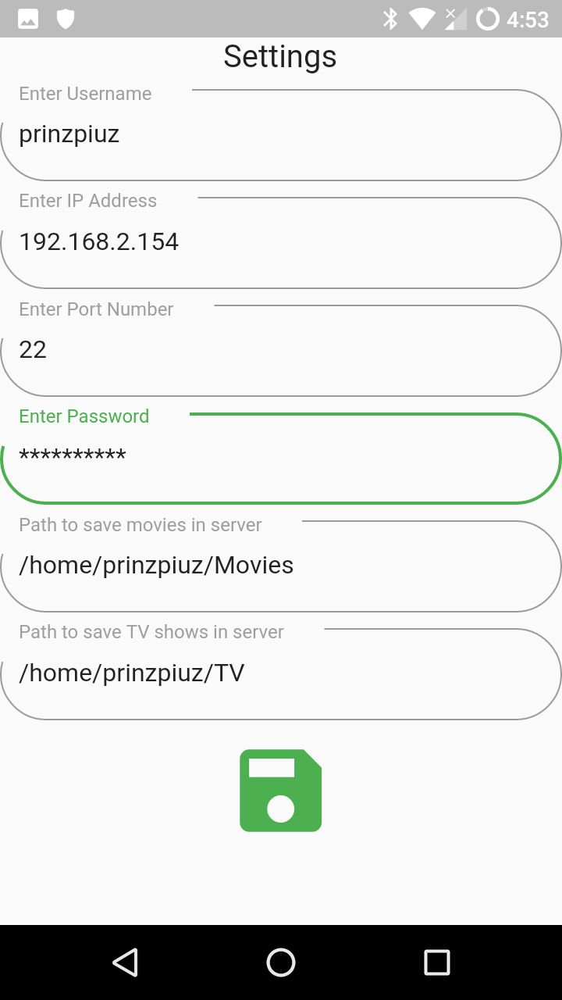](screenshots/settings.jpg)
[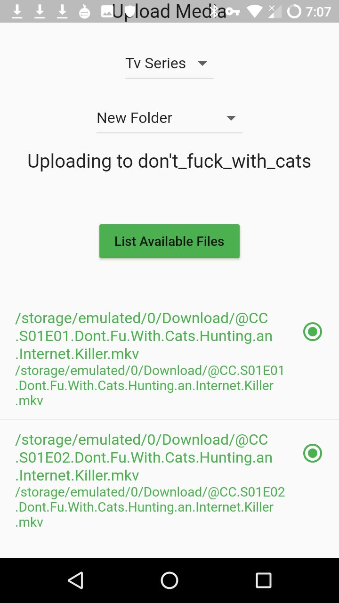](screenshots/upload_page.jpg)
[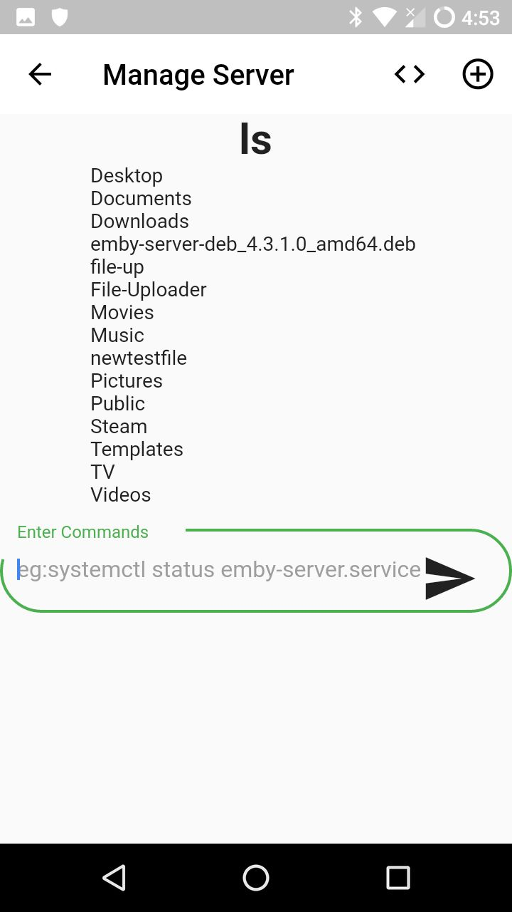](screenshots/live_shell.jpg)
[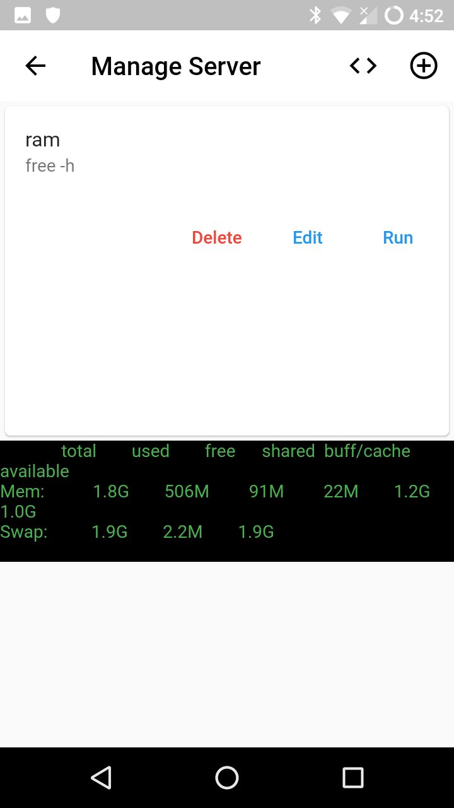](screenshots/manage_server1.jpg)
[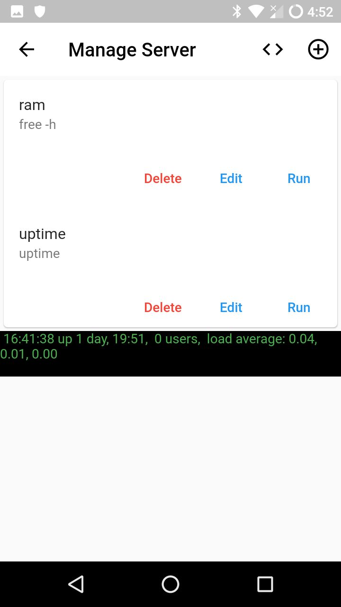](screenshots/manage_server2.jpg)
[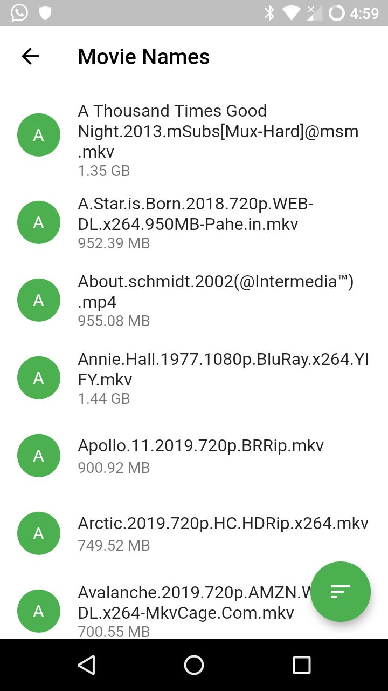](screenshots/movie_listing.jpg)
[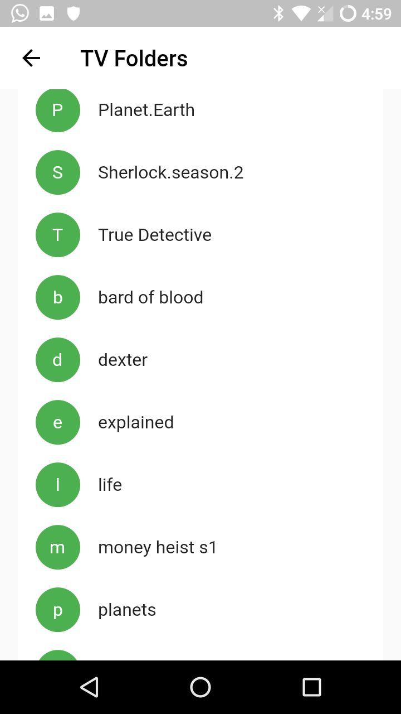](screenshots/tv_listing.jpg)
[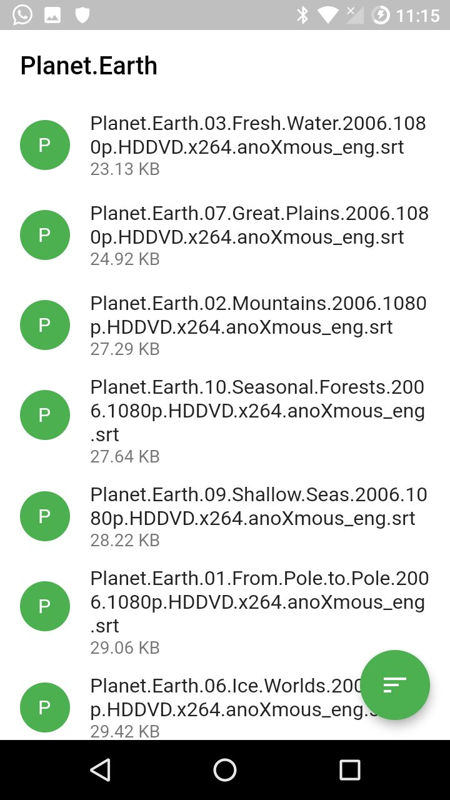](screenshots/tv_files.jpg)
[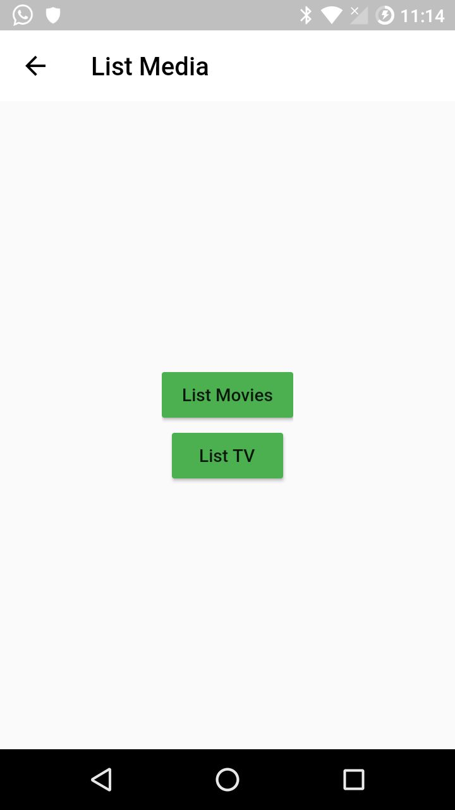](screenshots/list_media.jpg)

## Description

MSM works as wrapper around your Media server(emby, jellyfin, kodi, plex) and helps you to manage your media files, like CRUD operations also helps to manage server services without touching server. all you need is android mobile phone and media server which are connected to same network

### Features

- works on top of ssh
- CRUD options on files
- TV series can be created inside new folders or can be uploaded into existing folders
- Uploads run as backgroud tasks
- Server manager(live shell, saving oneline commands)

### Coming Features

- WOL and shutdown/reboot
- Multiple profiles
- User management based on linux user,group,permissions
- … and many more

## Contribution

Whether you have ideas, translations, design changes, code cleaning, or real heavy code changes, help is always welcome.
The more is done the better it gets! please join [Telegram](https://t.me/joinchat/FDVzK06Rt7vsNQLBLi2icw) for further discussion

## Setup

#### Server

- You need to configure ssh in your server 
- then configure a media server like [Emby](https://emby.media/), [Jellyfin](https://jellyfin.org/)
- Note the paths for  saving movies and tv shows (full path), root password, username, port (22(default) in most cases), IP address

#### Mobile

- Give the permission for accesing storage when application startup for first time
- Go to settings page and fill required fields
