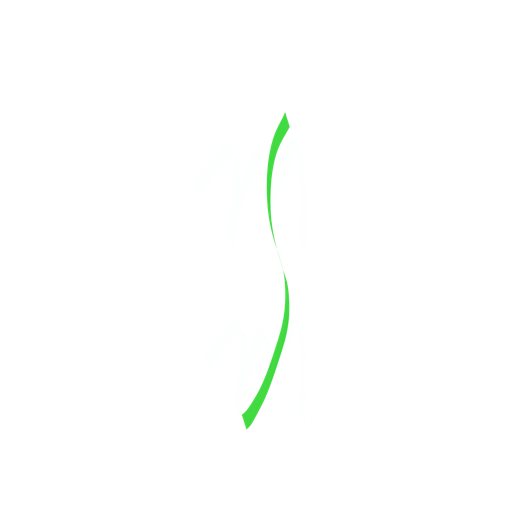

 
<h2 align="center"><b>MSM</b></h2>
<h4 align="center">All in one manager for your media server</h4>

<a href="#screenshots">Screenshots</a> &bull; <a href="#description">Description</a> &bull; <a href="#features">Features</a> &bull; <a href="#contribution">Contribution</a>&bull; <a href="#setup">How to setup a media server</a>

## Description

MSM works as wrapper around your Media server(emby, jellyfin, kodi, plex) and helps you to manage your media files, like CRUD operations also helps to manage server services without touching server. all you need is android mobile phone and media server which are connected to same network

### Features

- working on ssh
- CRUD options on files
- TV series can be created inside new folders or can be uploaded into existing folders
- Uplloads run as backgroud tasks

### Coming Features

- wol and shutdown/reboot
- systemd services
- custom commands to run in server
- … and many more

## Contribution

Whether you have ideas, translations, design changes, code cleaning, or real heavy code changes, help is always welcome.
The more is done the better it gets!

## Setup

will update this section
